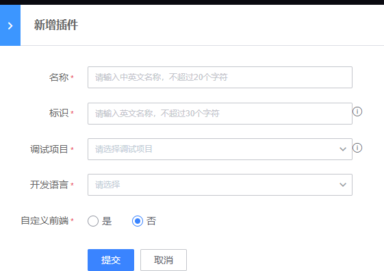
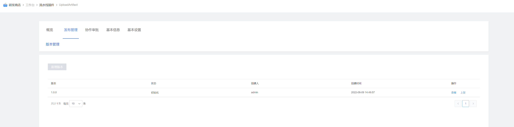
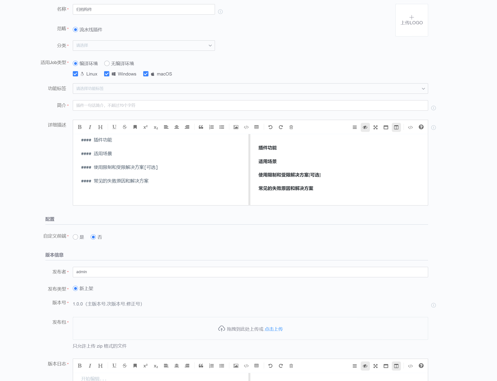
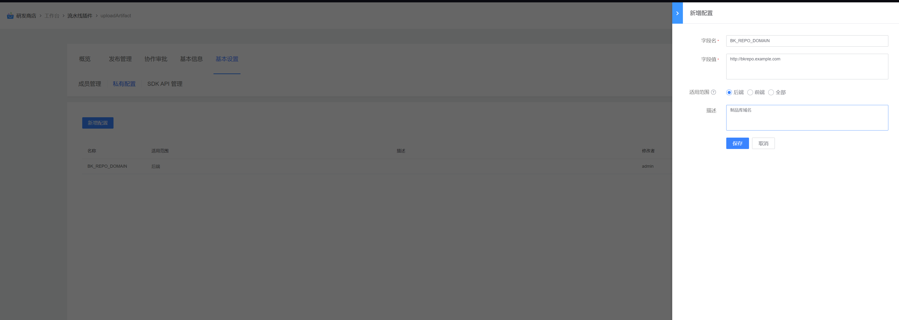

# 归档构件
将构建机上的文件归档到制品库，支持归档到流水线仓库或自定义仓库

## 使用指南
### 一、新增插件
在蓝盾的研发商店->工作台->新增插件 页面

各字段值填写如下:

名称: 归档构件（这个可以自定义)

标识: uploadArtifact

调试项目: 选择自己的项目

开发语言: java

自定义前端: 否

### 二、发布管理
新增插件后，就会跳转到插件发布管理界面,点击"上架”

### 三、上架插件

步骤:

1.上传插件图标,插件图标可以直接使用[uploadArtifact](images/uploadArtifact.png)

2.插件job类型,linux、macos、windows都选上

3.上传插件包，插件包从[releases](https://github.com/TencentBlueKing/ci-uploadArtifact/releases)下载最新版本插件zip包

4.填写发布日志

5.配置插件私有配置
 
 - 字段名: BK_REPO_DOMAIN
 - 字段值: http://bkrepo.example.com

### 四、插件描述
[插件描述](docs/desc.md)