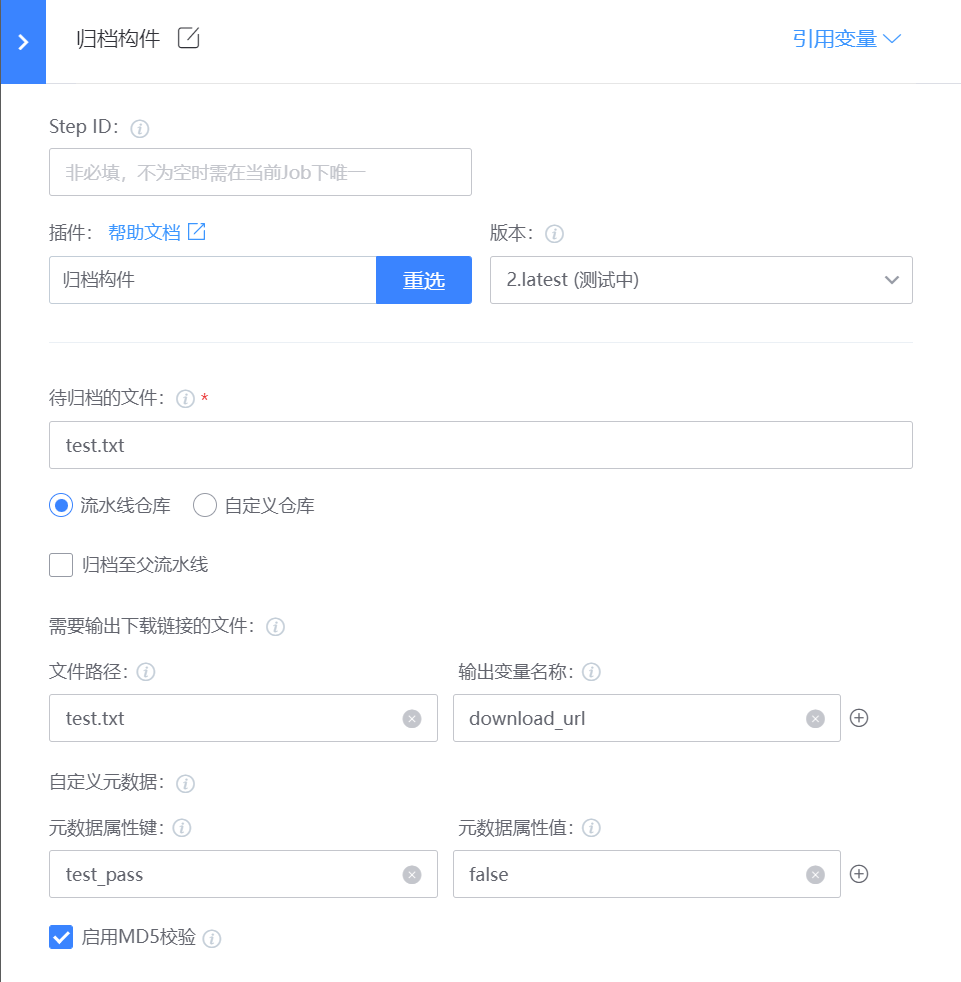

# 归档构件
将构建机上的文件归档到制品库，支持归档到流水线仓库或自定义仓库

## 使用指南
### 一、新增插件
在蓝盾的研发商店->工作台->新增插件 页面

各字段值填写如下:

名称: 归档构件（这个可以自定义)

标识: uploadArtifact

调试项目: 选择自己的项目

开发语言: java

自定义前端: 否

### 二、发布管理
新增插件后，就会跳转到插件发布管理界面,点击"上架”

### 三、上架插件

步骤:

1.上传插件图标,插件图标可以直接使用[uploadArtifact](images/uploadArtifact.png)

2.插件job类型,linux、macos、windows都选上

3.上传插件包，插件包从[releases](https://github.com/TencentBlueKing/ci-uploadArtifact/releases)下载最新版本插件zip包

4.填写发布日志

5.配置插件私有配置
 
 - 字段名: BK_REPO_DOMAIN
 - 字段值: http://bkrepo.example.com

### 四、配置插件
当插件上架后，就可以在流水线中选择插件，插件配置如下:

- 待归档的文件(filePath): 归档当前工作空间相对路径或绝对路径目录下的构建产物，可以用通配符匹配，支持多个路径(以英文 , 隔开)，不支持归档目录
- 归档仓库(repoName): 流水线仓库：以流水线名称+构建号自动生成的目录结构;自定义仓库：可自定义仓库目录结构，不存在将自动创建
- 归档至父流水线(isParentPipeline): 是否归档至父流水线的流水线仓库，需要配合子流水线调用插件使用
- 自定义仓库的归档目录(destPath): 归档至自定义仓库时的目标目录路径
- 需要输出下载链接的文件(downloadFiles): 选填。可以填写多组，每组一个文件路径对应一个输出变量名称
- 自定义元数据(metadata): 选填。可以填写多组，每组为一个元数据的键值对
- 启用MD5校验(enableMD5Checksum): 上传文件时校验文件MD5